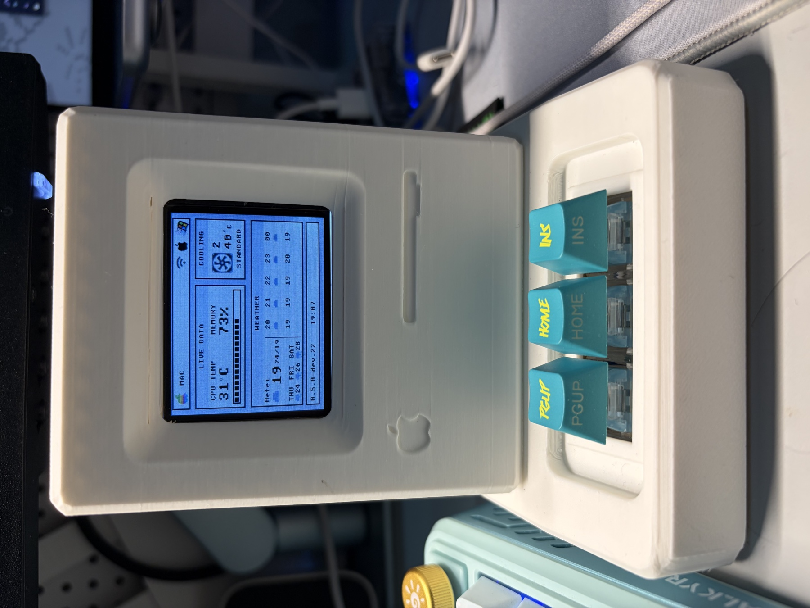
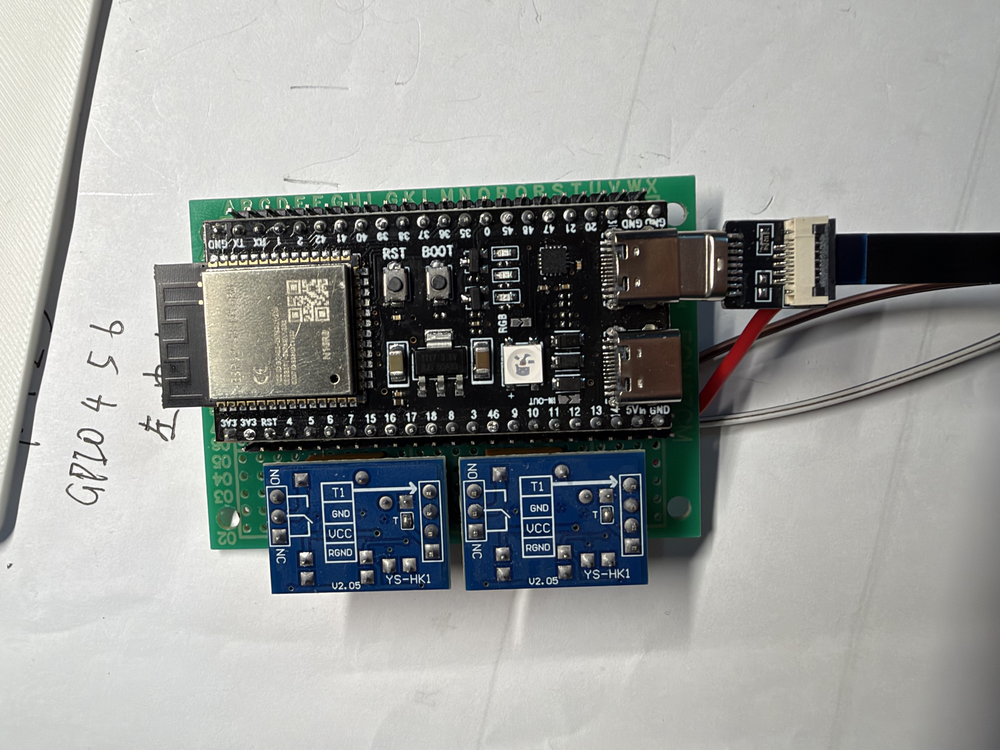
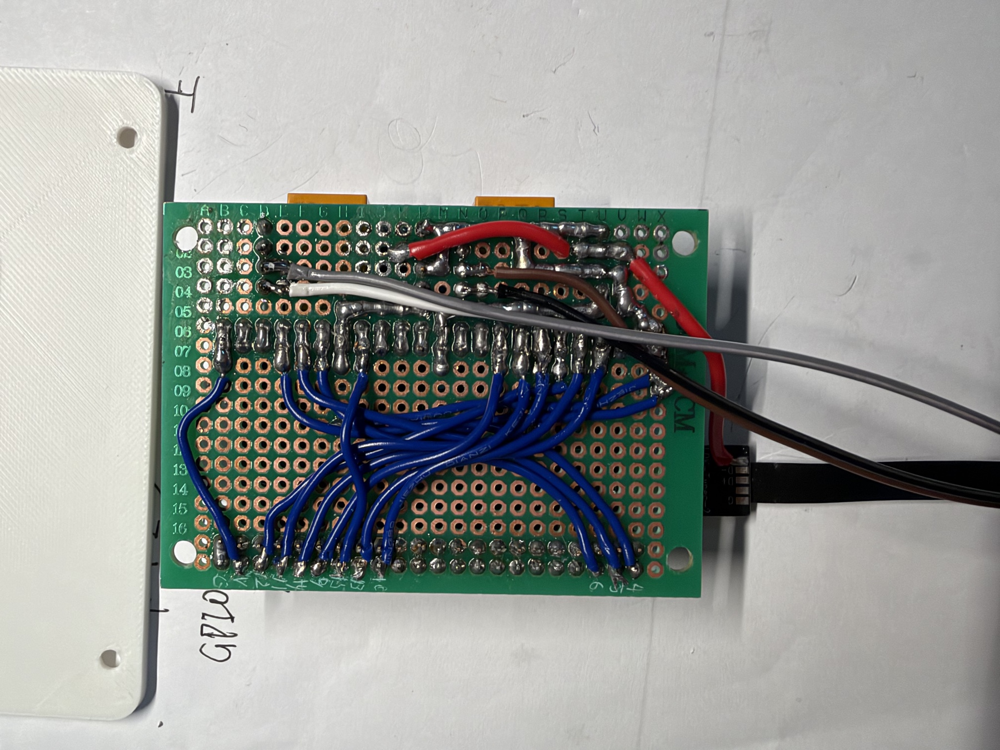

# ESP32-S3 KVM Desktop Controller

<p align="center">一个把 Mac、Windows、显示器、USB 共享器和桌面设备连接起来的复古风格桌面 KVM 控制器。</p>

## 项目简介

这个项目使用 ESP32-S3 作为硬件控制中心，并配合 macOS、Windows 客户端，实现两台电脑共用一套显示器、键盘和鼠标。

用户可以通过实体按键完成主机切换，也可以在状态屏上查看两台电脑、网络、KVM 和散热器的实时状态。

## 主要功能

| 功能 | 说明 |
| --- | --- |
| 双主机 KVM | 在 Mac 和 Windows 之间切换显示器输入与 USB 共享器归属 |
| 外接显示器控制 | 通过 DDC/CI 切换显示器输入，并在确认成功后执行 USB 切换 |
| 状态屏 | 显示主机连接、网络、KVM、错误和设备状态 |
| 信息面板 | 提供 `SYSTEM`、`WEATHER`、`MARKETS` 三个页面 |
| 天气与行情 | 显示当前天气、未来天气、BTC/USDT、DOGE/USDT 和 USD/CNY |
| 主备数据源 | Windows 作为主数据源，macOS 可作为备用数据源 |
| 显示输出休眠 | 只停止或恢复视频输出，电脑本身继续运行 |
| 外置散热器 | 支持 Manual、Standard、Silent、Turbo 四种模式 |
| 实体按键 | 不依赖触摸屏或额外控制面板 |

## 成品展示

当前原型已经完成外壳、状态屏、ESP32-S3 控制板和实体按键的组装：

<p align="center">
  
</p>

当前控制板固定方式和主板走线如下：

<p align="center">
  
  
</p>

详细说明请参阅：[硬件装配与走线实拍](docs/hardware-assembly.md)。

## 硬件组成

- ESP32-S3-N16R8 开发板
- ILI9341 320×240 横屏显示模块
- 支持 DDC/CI 的外接显示器
- USB 共享器和继电器控制电路
- Mac 与 Windows 主机
- 外置散热器及其继电器控制接口
- Apple Retro Hybrid V119 3D 打印外壳

这个项目涉及实际电源、继电器和 USB 接线。制作或修改硬件前，请先阅读硬件接口文档，并在断电状态下完成通断和短路检查。

## 软件组成

### ESP32-S3 固件

当前固件版本为 `v0.5.0-dev.22`，源码位于 [`esp32/latest/`](esp32/latest/)。它负责：

- 按键识别和页面切换
- LCD 显示与背光控制
- Wi-Fi 和 WebSocket 通信
- 主机状态、dashboard 和错误状态缓存
- KVM 继电器控制
- 散热器控制

### macOS 客户端

[`StatsForKVM/`](StatsForKVM/) 包含完整的 Xcode 工程。当前版本为 `v0.1.0-dev`，支持基础遥测、dashboard、DDC/KVM 和显示输出休眠/唤醒。

当前 macOS Release App 已打包在 [`releases/macos/`](releases/macos/) 中。

### Windows 客户端

[`Windows/`](Windows/) 包含完整的 C# / .NET 8 托盘客户端源码、自动测试和 `v3.0.0` 成品包。它支持每秒系统遥测、DDC/KVM 切换、显示输出休眠/唤醒，以及天气和行情 dashboard；Windows 是 dashboard 主数据源，断线后由 macOS 备用数据接管。

当前 Windows Release 已打包在 [`Windows/release/`](Windows/release/) 中。

## 当前状态

这是一个正在进行实机联调的开发版本，不是正式发行版。

- ESP32-S3 固件已经完成 ESP-IDF 编译。
- macOS 客户端代码已经同步当前 dashboard、KVM 和显示输出休眠/唤醒协议。
- Windows `v3.0.0` 源码、自动测试和 win-x64 成品已经同步。
- 当前仍需完成 ESP32、macOS、Windows 三端硬件联调。
- 不同显示器、USB 共享器和局域网环境可能需要单独调整配置。

## 项目目录

```text
esp32/          ESP32-S3 固件、历史版本和验证工程
StatsForKVM/    macOS 菜单栏客户端、KVM 功能和 protocol v1
Windows/        Windows 托盘客户端、自动测试、文档和 win-x64 成品
cad_enclosure/  3D 打印外壳、STL 和生成脚本
m1ddc/          DDC 控制的第三方参考源码
docs/images/    硬件装配图和成品照片
releases/       macOS 开发版应用压缩包
```

## 开始使用

1. 先阅读 [硬件装配与走线实拍](docs/hardware-assembly.md) 和 [项目需求](project_requirements.md)。
2. 使用 `esp32/latest/` 中的固件源码和配置模板准备 ESP32-S3。
3. 在 Mac 上打开 `StatsForKVM/Stats.xcodeproj`，或直接体验 `releases/macos/` 中的开发版 App。
4. Windows 可直接使用 [`Windows/release/`](Windows/release/) 中的成品，或按 [`Windows/README.md`](Windows/README.md) 从源码构建。
5. 按照 [通信协议](StatsForKVM/PROTOCOL.md) 配置客户端和 ESP32 地址。

## Apple 商标声明

Apple、Apple 标志、Macintosh 和 Mac 是 Apple Inc. 在美国及其他国家和地区的商标。本项目与 Apple Inc. 没有隶属、赞助或官方认可关系。

本项目外壳中的 Apple 标志及相关视觉元素，其版权和商标权归 Apple Inc. 所有；本项目仅用于个人硬件项目展示和开源研究。

## 致谢

本项目使用并感谢以下开源项目：

- [Stats](https://github.com/exelban/stats)：macOS 菜单栏系统监控基础。
- [m1ddc](https://github.com/waydabber/m1ddc)：Apple Silicon Mac 外接显示器 DDC 控制基础。

对应的 MIT 许可证和版权声明保留在仓库中，详见 [第三方组件声明](THIRD_PARTY_NOTICES.md)。

## 许可证

本项目自行编写的软件代码采用 [MIT License](LICENSE)。Stats 和 m1ddc 保留各自的原始版权和许可证声明。
